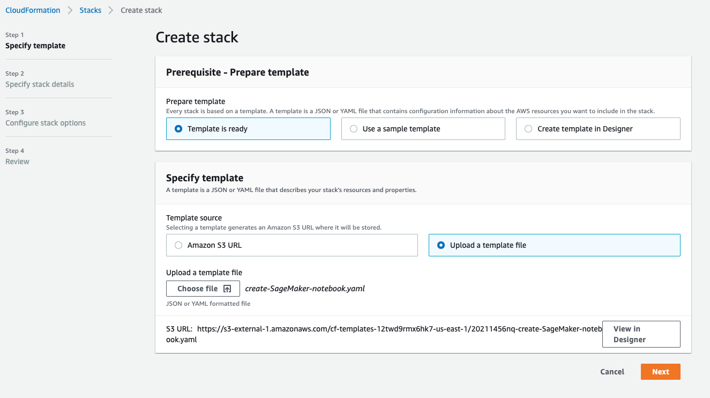
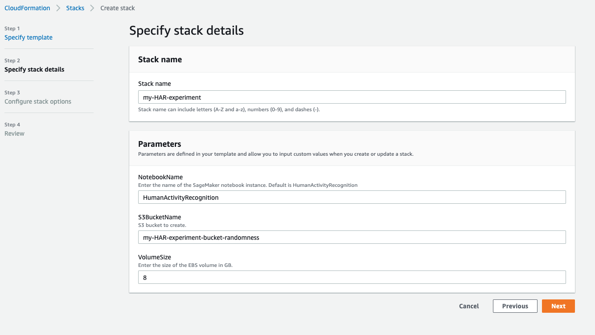
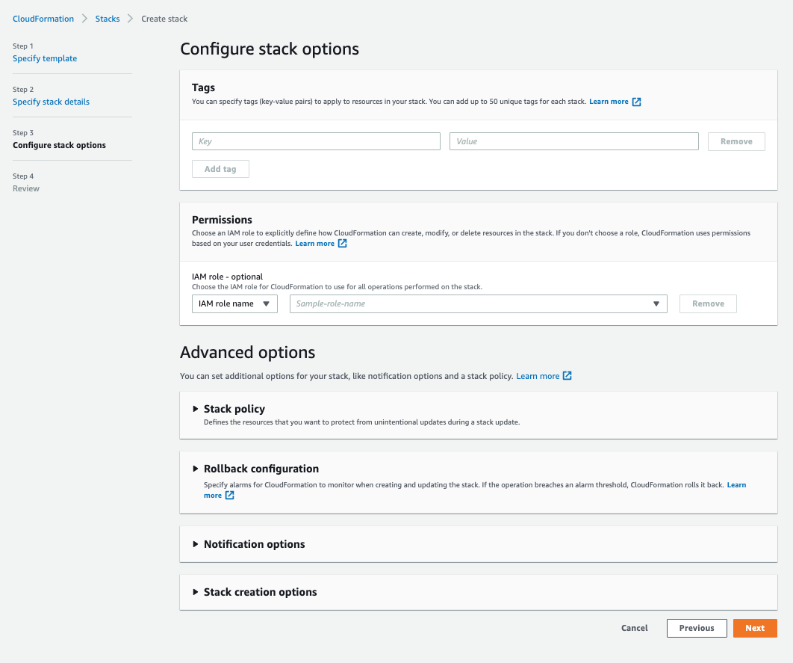
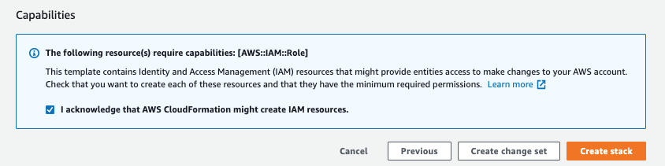
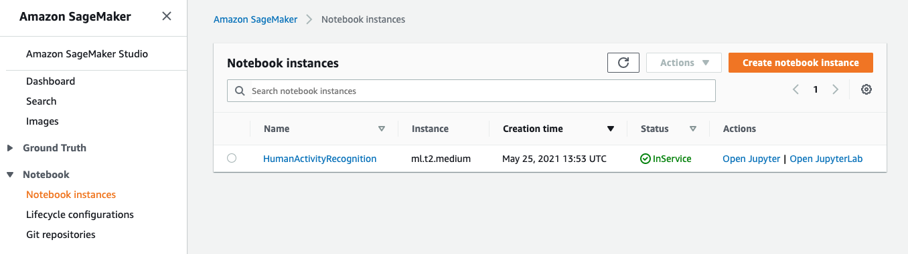
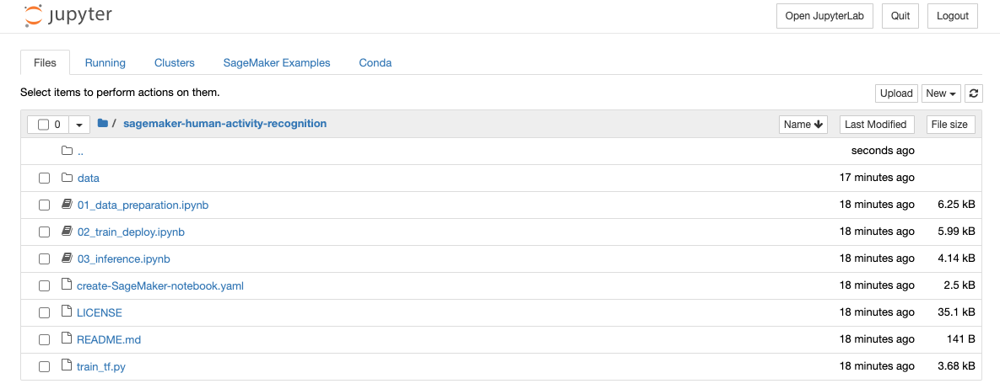

# Human Activity Recognition using Amazon SageMaker

This project demonstrates using the Amazon SageMaker platform to ingest multi-variate time-series sensor data and create an activity class predictor.

The inspiration for this project originates in a public dataset available at https://www.kaggle.com/malekzadeh/motionsense-dataset.  Originally, the dataset input exists as 360 comma-separated files within a nested A_DeviceMotion_data ZIP archive.  First level folders in the archive contain folders that indicate the activity performed.  Next level folders contain recordings by trial individuals who were wearing a device that collected acceleromater and gyroscope measurements, sampled at 50 Hz (e.g. measurements per second).

The original CSV files contain 12 time-series measures: 
- attitude.roll, attitude.pitch, attitude.yaw
- gravity.x, gravity.y, gravity.z, 
- rotationRate.x, rotationRate.y, rotationRate.z, 
- userAcceleration.x, userAcceleration.y, userAcceleration.z

Activity classes in include:
downstairs, upstairs, sitting, standing, walking, jogging

This project has pre-processed the 360 CSV files and makes them available for use in a SageMaker notebook, which is automatically created when you follow the steps in "Getting Started".

# Getting Started

You will need an AWS account to complete this project.  Once you have an account and are logged in with necessary permissions, this next procedure will create a SageMaker notebook for you, including all necessary code and data to train a SageMaker model and host an API endpoint for inference.

Procedure:
1. Download the create-SageMaker-notebook.yaml.  You may keep this file local or post it to an S3 location of you choosing.
2. Login to the AWS Console.
3. Navigate to CloudFormation at https://console.aws.amazon.com/cloudformation.   
4. Once in CloudFormation, click Create Stack.  Click upload a template file and then select "choose file".  Nagivate to the yaml file saved locally and click NEXT.

4. At CloudFormation Create Stack Step 2, provide a Stack Name and new unique S3 bucket name of your choice.  You may edit the NotebookName; an 8GB volume is enough for this project with some room for extra experimentation.

4. At CloudFormation Create Stack Step 3, you may click NEXT at the bottom of the screen.

4. At CloudFormation Create Stack Step 4, acknowlege that resources will be created at the bottom, as shown, and click "Create Stack".

This procedure will launch a new Notebook and seed it with data and example programs.   The process should take about 5 minutes to complete.

# Opening Your Notebook
Once your stack has launched, navigate to SageMaker at https://console.aws.amazon.com/sagemaker.  In the left pane, expand "Notebook" and click on Notebook Instances.  Your notebook will appear in the list, click on the Open Jupyter link.

# Executing the Notebooks
Once inside your notebook, click on the project directory folder and you will see three notebooks as shown, 01_data_preparation, 02_train_deploy, 03_inference.   You will execute each of cells in each of these notebooks in order.  Follow instructions inside each notebook.

# Remember to clean-up when done
This will include deleting any running SageMaker Endpoint created.  Use CloudFormation to delete your Stack.  You may also clean up or delete the S3 bucket used for the project as well.

# License & Contributing
The contents of this workshop are licensed under GNU General Public License v3.0.  Content is free and open use and without warranty or liability as described in the GNU terms.
